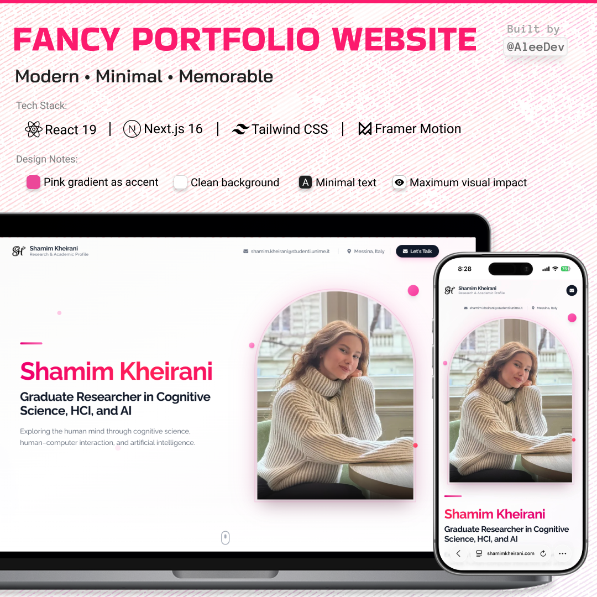
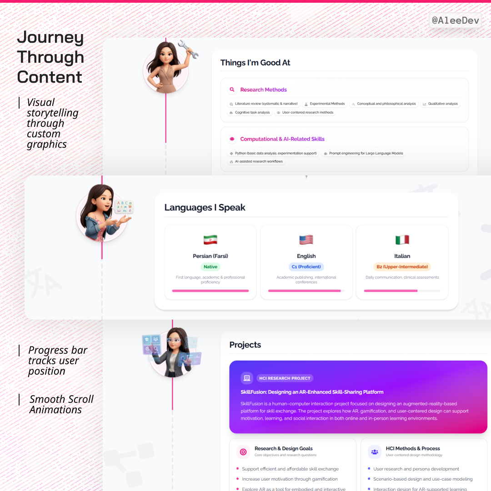
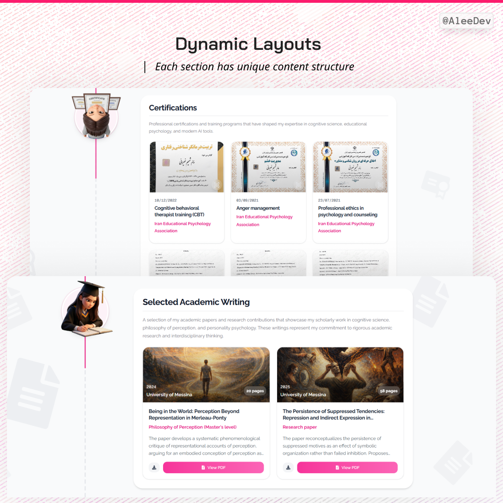
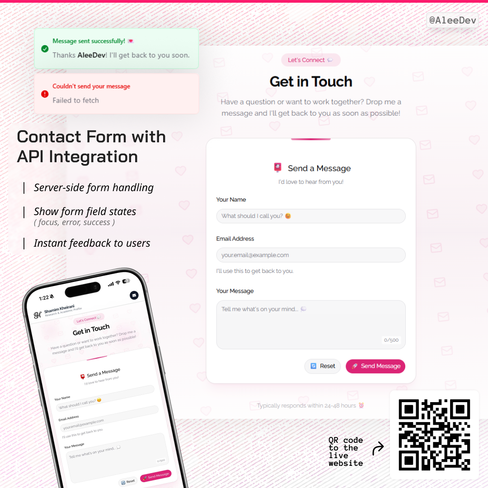

# 🌟 Modern Portfolio Website - Shamim Kheirani

[](https://www.shamimkheirani.com/)
[](https://www.shamimkheirani.com/)

A sophisticated, modern portfolio website showcasing elegant design and cutting-edge web development. Built for an academic researcher with a focus on minimal aesthetics, smooth animations, and exceptional user experience.







---

## ✨ Project Highlights

This is a **custom-built portfolio website** demonstrating professional web development capabilities:

- 🎯 **Unique Timeline Navigation** - Innovative vertical timeline system
- ⚡ **Lightning Fast** - Optimized for performance and SEO
- 📱 **Fully Responsive** - Seamless experience across all devices
- ♿ **Accessible** - WCAG 2.1 AA compliant
- 🎨 **Modern Design** - Elegant, minimal aesthetic with smooth animations

---

## 🚀 Tech Stack

| Category | Technologies |
|----------|-------------|
| **Framework** | Next.js 16 (App Router), React 19 |
| **Language** | TypeScript 5 |
| **Styling** | Tailwind CSS 4 |
| **Animations** | Framer Motion 12 |
| **UI Components** | Shadcn/ui, Radix UI |
| **Forms** | React Hook Form + Zod |
| **Email** | Next.js API Routes + Nodemailer |

---

## 🎨 Key Features

### 🧭 Innovative Timeline Navigation
- Custom-built vertical timeline system
- Animated scroll progress tracking
- Dedicated icon for each content section
- Responsive scaling


### ✨ Smooth Animations
- Framer Motion powered transitions
- Scroll-triggered section reveals
- Micro-interactions and hover effects
- Gradient animations and floating particles


### 📱 Mobile-First Design
- Responsive across all breakpoints
- Touch-optimized interactions
- Adaptive typography and layouts
- Performance optimized for mobile


### 🎯 Section Architecture
- Modular component system
- Custom decorative background patterns
- 4 unique icon placement variants
- Algorithmic visual depth creation


### 📧 Interactive Contact Form
- Real-time validation
- Server-side email integration
- Custom styled components
- Loading states and feedback


---

## 📊 Architecture Overview

```
┌─────────────────────────────────────────────────────┐
│                   Next.js App Router                 │
├─────────────────────────────────────────────────────┤
│  Hero Section → Timeline Layout → Contact Section   │
├─────────────────────────────────────────────────────┤
│                 Timeline System                      │
│  ┌─────────────────────────────────────────────┐   │
│  │  Progress Tracker                            │   │
│  │  ↓                                           │   │
│  │  Timeline Nodes (Custom Icons)              │   │
│  │  ↓                                           │   │
│  │  Section Layout (Background Patterns)       │   │
│  │  ↓                                           │   │
│  │  Content Components (Dynamic)               │   │
│  └─────────────────────────────────────────────┘   │
├─────────────────────────────────────────────────────┤
│              API Routes (Contact Form)               │
├─────────────────────────────────────────────────────┤
│        Tailwind CSS + Framer Motion Styling         │
└─────────────────────────────────────────────────────┘
```

### Component Architecture
- **Config-Driven Content**: TypeScript interfaces for type-safe content management
- **Modular Sections**: Reusable components with customizable layouts
- **Responsive Hooks**: Custom `useResponsiveScale` for adaptive sizing
- **Animation System**: Centralized Framer Motion variants

---

## 🎯 Technical Highlights

### Performance Optimization
- ⚡ Next.js Image Optimization
- 📦 Automatic Code Splitting
- 🔄 Lazy Loading Components
- 🚀 Edge Network Deployment (Vercel)
- 📊 Lighthouse Score: 95+

### SEO & Accessibility
- 🔍 Structured Data (JSON-LD)
- 📱 Open Graph Meta Tags
- 🎯 Semantic HTML
- ⌨️ Full Keyboard Navigation
- 👁️ Screen Reader Optimized
- ♿ WCAG 2.1 AA Compliant

### Custom Implementations
- **Timeline Algorithm**: Built from scratch without external libraries
- **Icon Placement Engine**: Algorithmic background decoration system
- **Responsive Scale System**: Mathematical scaling across breakpoints
- **Animation Orchestration**: Complex timing and sequence coordination


---

## 🌟 What Makes This Project Special

### Innovation
- ✅ **Custom Timeline System** - No template or library used
- ✅ **Algorithmic Design** - Background patterns generated via code
- ✅ **Performance First** - Optimized for real-world usage
- ✅ **Accessibility Focus** - Inclusive design from the start

### Professional Quality
- ✅ **Production Deployment** - Live and serving real users
- ✅ **Type Safety** - Full TypeScript implementation
- ✅ **Best Practices** - Clean code, proper structure
- ✅ **Modern Stack** - Latest versions of cutting-edge tools

### Design Excellence
- ✅ **Consistent Branding** - Cohesive visual identity
- ✅ **Attention to Detail** - Polished micro-interactions
- ✅ **User-Centered** - Intuitive navigation and flow
- ✅ **Responsive** - Flawless on all devices

---

## 🎯 Use Cases

This project demonstrates expertise in:

- ✨ Modern web application development
- 🎨 UI/UX design and implementation
- ⚡ Performance optimization techniques
- 📱 Responsive and mobile-first design
- ♿ Web accessibility standards
- 🚀 Production deployment and DevOps

**Perfect for:**
- Portfolio showcases
- Academic/research profiles
- Professional landing pages
- Personal branding websites

---

## 🔗 Live Demo

**Visit the live website:** [shamimkheirani.com](https://www.shamimkheirani.com/)

Experience the smooth animations, responsive design, and intuitive navigation firsthand.

---

## 📞 Interested in a Custom Website?

I build modern, performant, and beautiful websites tailored to your needs.

### What I Offer:
- 🎨 Custom Design & Development
- ⚡ Performance Optimization
- 📱 Mobile-First Responsive Design
- ♿ Accessibility Compliance
- 🔍 SEO Optimization
- 🚀 Deployment & Maintenance

### Tech Expertise:
- Next.js / React
- TypeScript
- Tailwind CSS
- Framer Motion
- Node.js / API Development
- Vercel / Cloud Deployment

---

## 📧 Get in Touch

Interested in working together or have questions about this project?

- 📧 **Email:** [ali.kheirani@gmail.com](mailto:ali.kheirani@gmail.com)
- 💼 **LinkedIn:** [LinkedIn Profile](https://linkedin.com/in/ali-kheirani-a5a17a248)
- 🐙 **GitHub:** [GitHub](https://github.com/aleedevp)

---

## ⭐ Appreciation

If you found this project interesting or inspiring, please consider:
- ⭐ **Star this repository**
- 🔄 **Share with others**
- 💬 **Reach out for collaborations**

---

## 📄 License & Usage

**Note:** This is a showcase repository. The source code is **proprietary and not available for use**.

If you're interested in:
- Building a similar website
- Collaborating on a project
- Learning about the implementation

Please contact me directly. I'm happy to discuss custom projects or consulting opportunities.

---

## 🙏 Acknowledgments

- Built with modern web technologies
- Designed with user experience in mind
- Deployed on Vercel's edge network
- Crafted with attention to every detail

---

<div align="center">

**⚡ Fast • 🎨 Beautiful • ♿ Accessible • 📱 Responsive**

Made with ❤️ and lots of ☕

[🌐 View Live Site](https://www.shamimkheirani.com/) • [📧 Contact Me](mailto:ali.kheirani@gmail.com)

</div>
